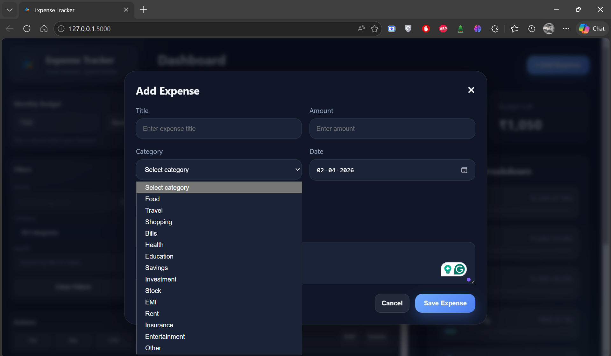
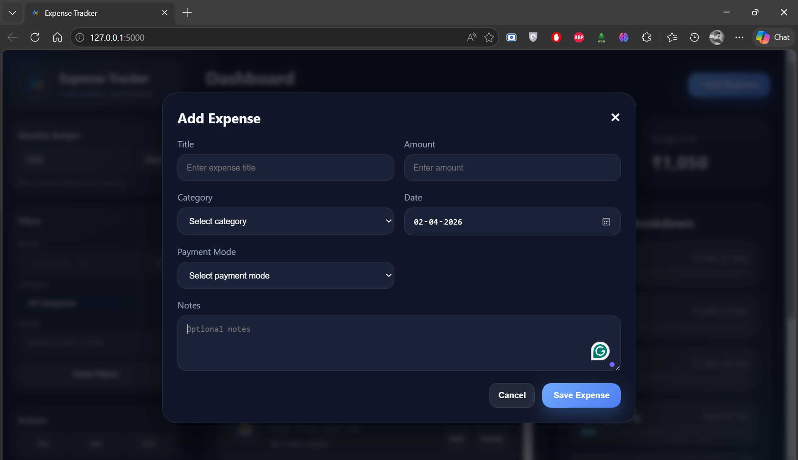
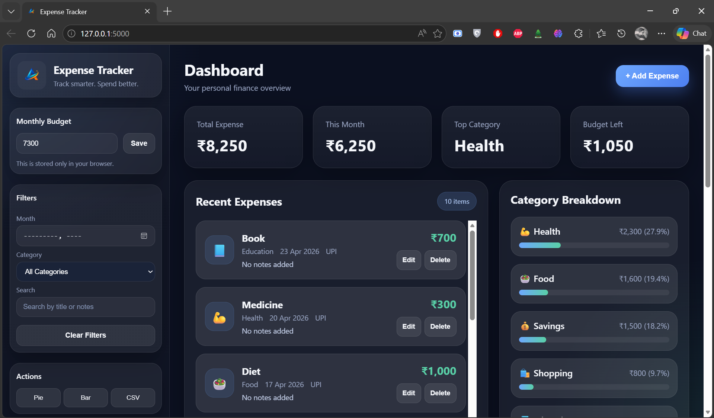
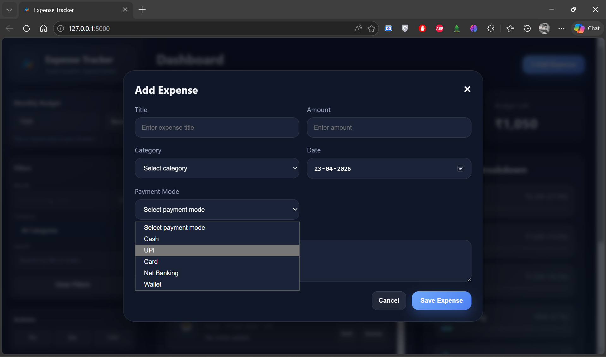
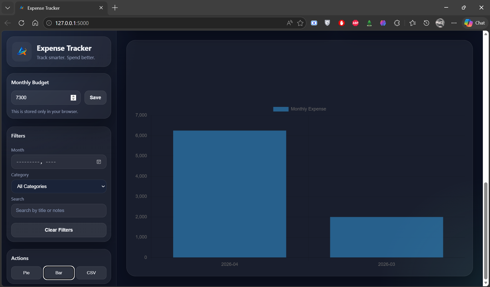
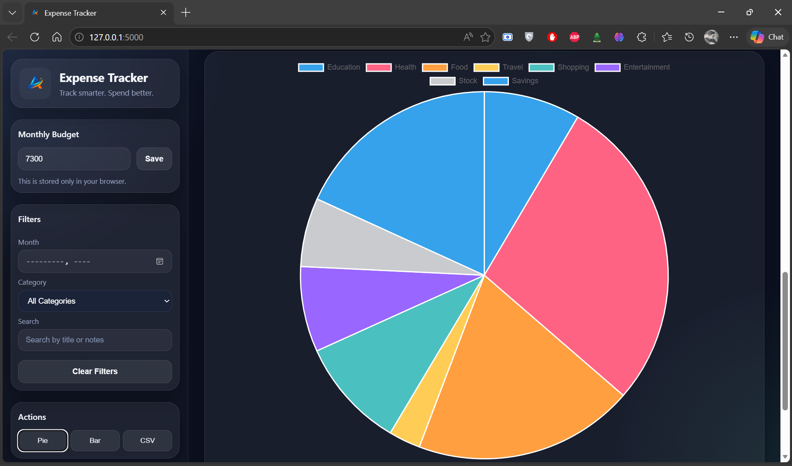

# Expense Tracker
A web-based expense tracking system to manage daily spending, monitor budgets, and visualize financial data.

## Features
- Add, edit, and delete expenses
- Categorize expenses (Food, Travel, Shopping, etc.)
- Track monthly budget
- Dashboard showing:
  - Total expense
  - Monthly expense
  - Top category
  - Remaining budget
- Category-wise breakdown
- Filters (month, category, search)
- Data visualization:
  - Pie chart (category distribution)
  - Bar chart (monthly comparison)
- Export data as CSV

## Tech Stack
- HTML  
- CSS  
- JavaScript  
- Python (Flask)  
- JSON (data storage)
  
## How to Run
1. Open terminal in project folder  
2. Activate virtual environment (if used)

```bash
.\.venv\Scripts\activate
```

3. Run the app

```bash
python app.py
```

4. Open browser:

```
http://127.0.0.1:5000
```

## Screenshots







---

## Notes
- Please do not reuse branding or logo without permission
